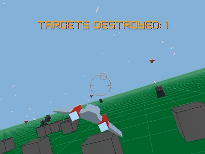

# Ray Squadron

Arcade flight action shooting game made using [Raylib](https://www.raylib.com/), built off the [Raylib Quickstart](https://github.com/raylib-extras/raylib-quickstart) (very handy!).

As of the time of this writing (September 12 2026), there is a full game loop with a title screen, and a short game to play which can be completed.

* Fly a little spaceship with WASD/Arrow Keys to blow up the blocks and red spaceships flying around the area.
* Shoot lasers with left control or left mouse button.
* Turrets which are there mostly just to look cool and spray fire around the map, because I am uploading this right after figuring out how to get the transform stuff working.
* As a consequence of the world state being stored in one big struct, I realized adding quicksaving/loading was pretty trivial, so you can quicksave/load with F5/F9.
* That's really it I guess!, but the controls and camera feel real good, it's my favorite part of this.

This isn't exactly what I would consider a "releasable game". There's still stuff in here hardcoded to my specific machine and preferences. This was never really meant to be a fully functional game in the first place, more just a programming exercise, and reference for myself and anybody else who might be interested.

### Portability

Raylib itself is included as a flat copy of the Raylib 6.2 as of August 2026, so there should be no need for linking it yourself from vcpkg, NuGet, a local repository, etc.

While the code and assets themselves would probably work just fine on other platforms, I have made no considerations to it being cross-platform so I can't guarantee anything beyond it working in my own preferred and checked in workflow of Visual Studio 2026 with MSVC.

## The C Programming Language

On a whim, I decided early on to do the game entirely in C instead of C++ like I typically do. It's built in what Visual Studio as of September 2026 calls "latest" which is going to be some half-implemented version of the C23 spec.

I occasionally use C. It was the first programming language I learned, but I'm definitely more of a C++ programmer, especially given that all my professional work has been with C++. This game has been a very deliberate "back to my roots" type endeavor, because what tends to happen is once a C project gets to a certain size, I get annoyed at the lack of C++ features and convert it to C++.

Fortunately, this time it actually *has* been very fun using plain old C again. There's so many times it has happened where if I was using C++ I know I would have gone crazy and totally over-engineered a solution but the friction to doing that kind of thing in C has been very refreshing this time. There are so many things, like for example just using fixed statically allocated arrays and just *not worrying about moving memory around or dynamic allocations*. Not only that, but it makes the code so much less complex and easier to understand because it's really not doing anything!

C is a very honest language. What you see is what you get.

Unlike [Ergo](https://github.com/brihernandez/Ergo), I didn't make any particular effort to make this super understandable. This is the raw code as I've been working on it, but even still I think it shouldn't be too hard to grasp. There's nothing particularly clever going on in the repository.

